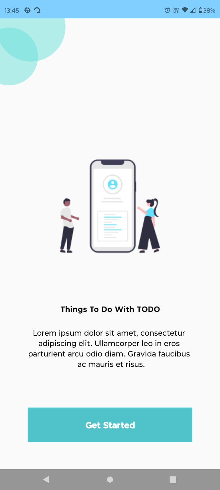
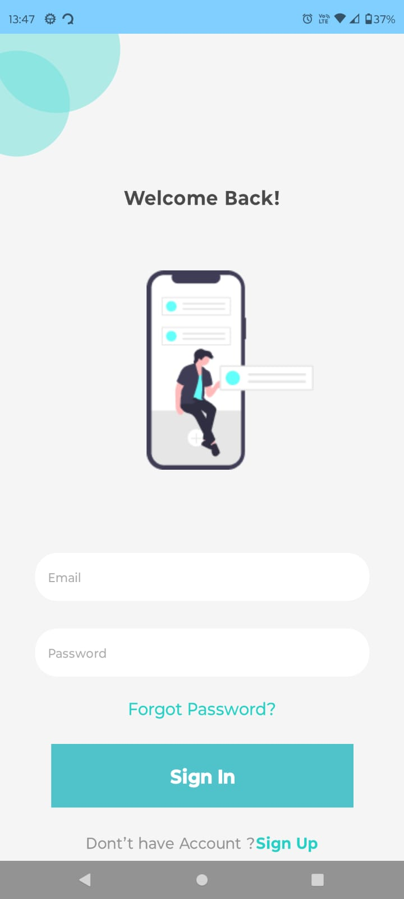
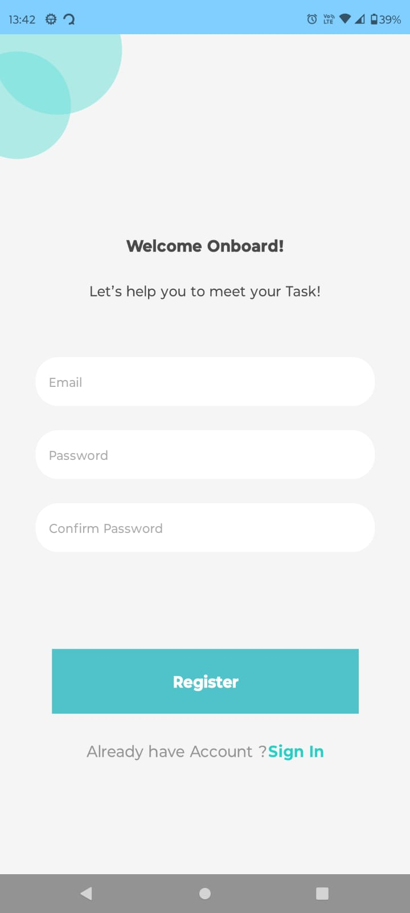
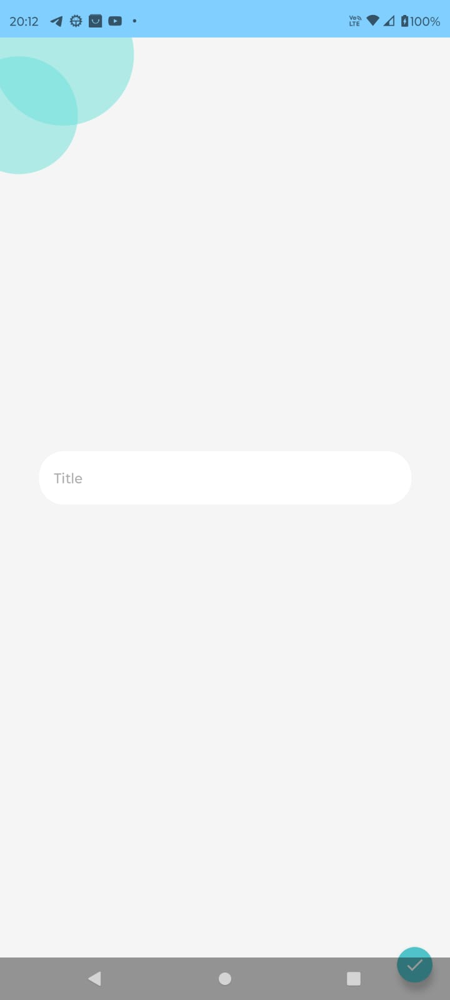
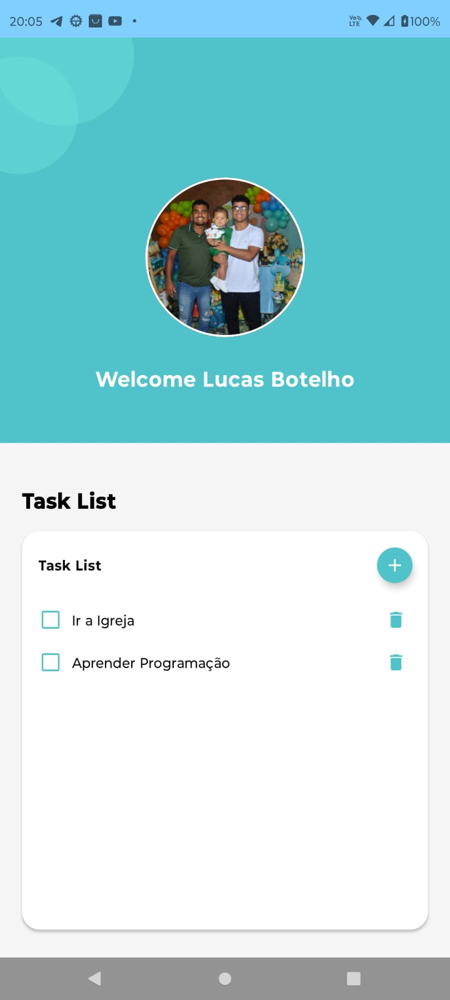
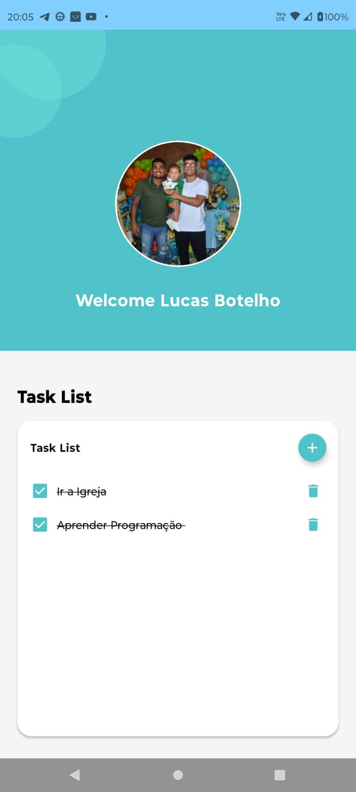

# MinimalistTodoApp

Agradeço a Deus por este projeto pronto, e a Ele toda Honra e Glória.

**Salmos 139:6**:
Tal conhecimento é maravilhoso demais para mim: é sobremodo elevado, não o posso atingir.

## UX/UI

https://www.figma.com/file/EWDM4L41923BvS6tqi8eKo/Todo-App-(Community)?type=design&mode=design&t=tDZE1iklAj5BzSjC-0

## Structure

- **MVVM**
- **Clean Code**
- **Firebase Authentication**
- **FireStore**
- **Jetpack Compose**
- **Jetpack Compose Canvas**
- **Coroutines**
- **Dagger/Hilt**

## Images

<table>
  <tr>
    <td><strong>ONBOARDING</strong></td> 
  </tr>
  <tr>
    <td></td> 
  </tr>
 </table>

<table>
  <tr> 
     <td><strong>SIGN IN</strong></td>
     <td><strong>SIGN UP</strong></td>
  </tr>
  <tr>
    <td></td>
    <td></td> 
  </tr>
 </table>

<table>
  <tr> 
    <td><strong>ADD TASK</strong></td>
    <td><strong>TASK</strong></td>
    <td><strong>TASK COMPLETED</strong></td>
  </tr>
  <tr> 
    <td></td>
    <td></td>
    <td></td>
  </tr>
 </table>